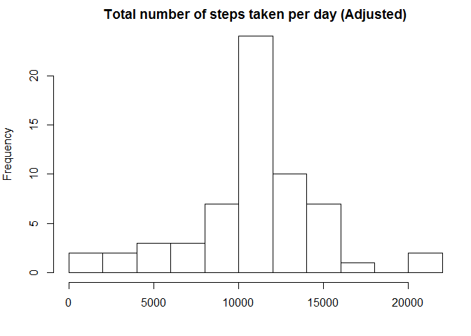

# Reproducible Research: Peer Assessment 1

'r opts_chunk$set(echo=FALSE, results = "hide")'

## Instructions

Download the necessary files from github

## Load libraries & set working directory

```r
library(plyr)
library(lattice)
```

## Loading and preprocessing the data


```r
unzip("C://Users//Chu Ying//RepData_PeerAssessment1//activity.zip")
data <- read.csv("C://Users//Chu Ying//RepData_PeerAssessment1//activity.csv", header=TRUE)
processed.data <- data[complete.cases(data),] 
```
## What is mean total number of steps taken per day?

1a. Make a histogram of the total number of steps taken each day


```r
par (mar=c(4,4,2,1))
hdata <- ddply (processed.data, .(date), summarize, sum=sum(steps))
hdata$nDate <- as.Date(hdata$date)
#hist (hdata$nDate, "days", format = "%d %b %y", xlab="Date", ylab="No. of Steps", main="Total no. of steps taken per day")

hist(hdata$sum, 10, main = "Total number of steps taken per day", xlab = "")
```

 

1b. Calculate and report the **mean** and **median** total number of steps taken per day


```r
round(mean(hdata$sum), 0)
```

```
## [1] 10766
```


```r
round(median(hdata$sum), 0)
```

```
## [1] 10765
```

## What is the average daily activity pattern?

2a. Make a time series plot (i.e. type = "l") of the 5-minute interval (x-axis) and the average number of steps taken, averaged across all days (y-axis)


```r
#Calculate average steps for each of 5-minute across all days
interval.mean <- ddply(processed.data,~interval, summarise, mean=mean(steps))

#Make a time series plot
plot(x = interval.mean$interval, y = interval.mean$mean, type = "l", xlab = "5-Minute Interval", ylab = "Average Number of Steps Taken", main = "Daily Activity Pattern")
```

 

2b. Which 5-minute interval, on average across all the days in the dataset, contains the maximum number of steps?


```r
interval.mean$interval[which.max(interval.mean$mean)]
```

```
## [1] 835
```
## Imputing missing values

3a. Calculate and report the total number of missing values in the dataset (i.e. the total number of rows with NAs)


```r
sum(is.na(data))
```

```
## [1] 2304
```

3b. Devise a strategy for filling in all of the missing values in the dataset. The strategy does not need to be sophisticated. For example, you could use the mean/median for that day, or the mean for that 5-minute interval, etc.

**Some data has missing values for the whole day. Therefore, I would fill those data by using the mean of the 5-minute interval. **

3c. Create a new dataset that is equal to the original dataset but with the missing data filled in.


```r
data <-  merge(data, interval.mean, by = "interval") #merge interval mean to original dataset
nas <- is.na(data$steps) #retrieve all NAs in steps column
data$steps[nas] <- data$mean[nas] #replace all NAs with interval mean
data.new <- data[, c(1:3)] #remove added column (i.e mean column)
```

3d. Make a histogram of the total number of steps taken each day 


```r
h2data <- ddply (data.new, .(date), summarize, sum=sum(steps))
par (mar=c(4,4,2,1))
hist(h2data$sum, 10, main = "Total number of steps taken per day", xlab = "")
```

 

3e. Calculate and report the mean and median total number of steps taken per day. Do these values differ from the estimates from the first part of the assignment? What is the impact of imputing missing data on the estimates of the total daily number of steps?


```r
round(mean(h2data$sum), 0)
```

```
## [1] 10766
```


```r
round(median(h2data$sum), 0)
```

```
## [1] 10766
```

Yes, the values differ from the estimates from the first part of the assignment. The impact of inputting missing data is minimal, as the median seems to change by only one step.

## Are there differences in activity patterns between weekdays and weekends?

4a. Create a new factor variable in the dataset with two levels - "weekday" and "weekend" indicating whether a given date is a weekday or weekend day.


```r
daytype <- function(date) {
    if (weekdays(as.Date(date)) %in% c("Saturday", "Sunday")) {
        "weekend"
    } else {
        "weekday"
    }
}

data.new$daytype <- as.factor(sapply(data.new$date, daytype))
head(data.new)
```

```
##   interval    steps       date daytype
## 1        0 1.716981 2012-10-01 weekday
## 2        0 0.000000 2012-11-23 weekday
## 3        0 0.000000 2012-10-28 weekend
## 4        0 0.000000 2012-11-06 weekday
## 5        0 0.000000 2012-11-24 weekend
## 6        0 0.000000 2012-11-15 weekday
```

4b. Make a panel plot containing a time series plot (i.e. type = "l") of the 5-minute interval (x-axis) and the average number of steps taken, averaged across all weekday days or weekend days (y-axis). 


```r
#Calculate average steps for each of 5-minute across all weekdays or weekends
interval.mean.new <- ddply(data.new, .(interval, daytype), summarise, mean=mean(steps))

par (mar=c(4,4,2,1))

p <- xyplot(mean ~ interval | factor(daytype), data=interval.mean.new, 
       type = 'l',
       layout = c(1, 2),
       main="Daily Activity Pattern (Weekday vs. Weekend)",
       xlab="5-Minute Interval",
       ylab="Average Number of Steps Taken")

print (p)    
```

 
